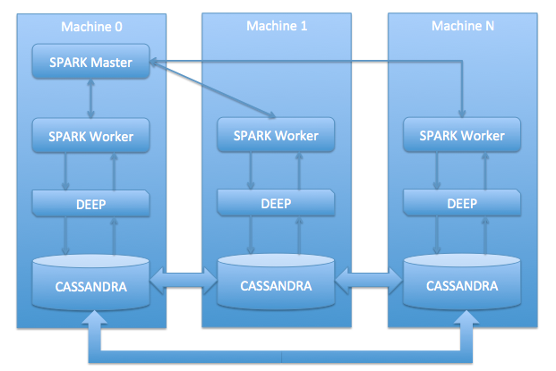

Stratio Deep is one of the core modules on which the Stratio platform is based. It’s a thin integration layer between 
[Apache Spark](http://spark.apache.org "Apache Spark project website") and 
[Apache Cassandra](http://cassandra.apache.org "Apache Cassandra project website").

Table of Contents
=================

-   [Introduction](#introduction)
-   [Features](#features)
-   [Architecture](#architecture)

Introduction
============

[Apache Cassandra](http://cassandra.apache.org "Cassandra project website") is an open source NoSQL database that 
can store large amounts of structured, semi-structured, and unstructured data. However it can not resolve all 
searches and the database schema needs to be designed according to the most usual queries that will be run. Most 
of the time, more than these queries will be needed and the schema can not be changed to meet a particular 
requirement. In those cases, a new approach allowing searching your database without restriction will be welcome. 
[Apache Spark](http://spark.apache.org "Apache Spark project website") resolves this problem providing mechanisms 
for large-scale data processing but does not provide out-of-the-box support for Cassandra. Stratio Deep is the 
Cassandra-Spark integration that will allow a limitless exploration of your data.

Features
========

-   Creates Spark Resilient Distributed Datasets (RDD) from Cassandra tables.
-   Efficiently writes large RDDs out to Cassandra table. Will create automatically missing output tables.
-   Maps a Cassandra split to a Spark RDD partition.
-   Ensures that data locality is respected: data is not shuffled to other machines unless strictly needed.
-   Provides ORM-like interface using annotations to map Cassandra tables to Java/Scala objects.
-   Provides an alternative generic interface to Cassandra tables using a Cells abstraction avoiding the need to create mapping Java/Scala objects.
-   Supports all CQL3 features:
    -   Wide rows: correctly handles Cassandra’s partition and clustering keys.
    -   Cassandra collection columns (sets, lists, maps).
    -   Uses Cassandra marshallers to map between Java and Cassandra’s byte buffers.
-   Leverages the power of Cassandra secondary indexes to efficiently access data.
-   Friendly API for both Java and Scala developers.
-   Provides a way to register your own callback to handle computation termination events.
-   The integration is not based on the Cassandra Hadoop interface.

Architecture
============

Stratio Deep, the integration of Apache Spark and Apache Cassandra, provides a Scala and Java API to manage and 
operate with Cassandra RDDs. In the next sections, after a quick introduction on Cassandra and Spark, Deep architecture 
is described.

Apache Cassandra
----------------

Apache Cassandra, a massively scalable open source NoSQL database, is the right choice when high availability without 
compromising performance is needed. It’s perfect for managing large amounts of structured, semi-structured, and unstructured 
data across multiple data centers and the cloud. A Cassandra cluster is shown in the figure below:

For more information, please visit the [Apache Cassandra](http://cassandra.apache.org/) web.

Apache Spark
------------

Spark started as a research project at the UC Berkeley AMPLab in 2009, and was open sourced in early 2010. Spark is 
a fast and general-purpose cluster computing system that leverages the MapReduce paradigm. It provides high-level 
APIs in Scala, Java and Python.

For more information, please visit the [Apache Spark](http://spark.apache.org/) web.

Stratio Deep
------------

Stratio Deep comes with a user friendly API that allows developers to create RDDs out of Cassandra tables. 
It provides two different interfaces for mapping Cassandra data to Java/Scala objects:

-   **Entities**: will let you map your Cassandra’s tables to entity objects, just like if you were using any other ORM. This abstraction is quite handy, it will let you work on RDD by mapping columns to entity properties and using their getter and setter to access the data. The figure below shows this paradigm:

-   **Cells**: a generic API that will let you work on Cassandra RDD without Scala/Java entity objects, by fetching automatically the columns metadata along with the data itself from the database. This interface is a little bit more cumbersome to work with (see the example below), but has the advantage that it does not require the definition of additional classes.

Stratio Deep consists of a set of libraries in Apache Spark that will provide the functionalities described above. A common Spark-Cassandra integration cluster will look like the figure below:

