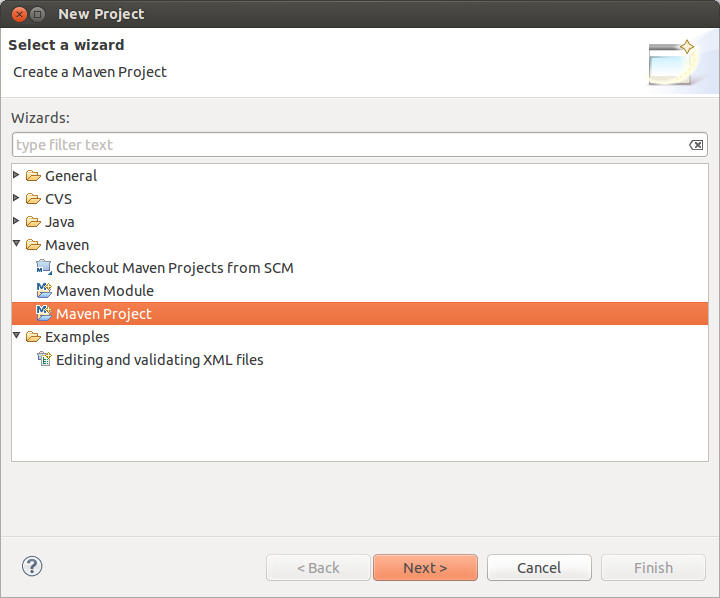
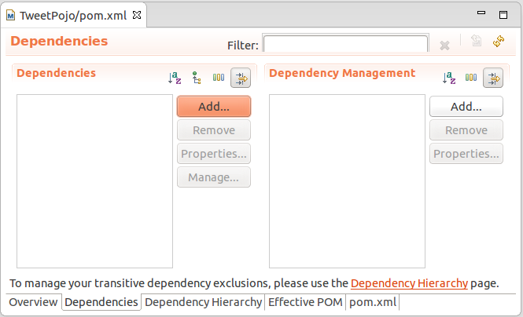
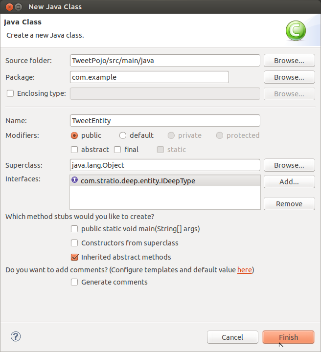

You will learn how to write an entity object for a Cassandra schema that can be used with Spark and Stratio Deep to access 
the data from a Java or Scala program through RDDs.

Table of Contents
=================

-   [Before you start](#before-you-start)
-   [Creating the tweets schema in Cassandra](#creating-the-tweets-schema-in-cassandra)
    -   [Step 1: Defining the schema](#step-1-defining-the-schema)
    -   [Step 2: Creating the table](#step-2-creating-the-table)
    -   [Step 3: Populating the table](#step-3-populating-the-table)
-   [Creating the Tweet entity](#creating-the-tweet-entity)
    -   [Step 1: Create a Maven Project](#step-1-create-a-maven-project)
    -   [Step 2: Set the dependencies](#step-2-set-the-dependencies)
    -   [Step 3: Code the TweetEntity class](#step-3-code-the-tweetentity-class)
    -   [Step 4: Package the entity](#step-4-package-the-entity)
-   [Using the entity with Stratio Deep](#using-the-entity-with-stratio-deep)
-   [Where to go from here](#where-to-go-from-here)
-   [Annexes](#annexes)
    -   [Cassandra-Java datatype Mapping](#cassandra-java-datatype-mapping)

Before you start
================

To follow this tutorial you will need the following:

-   A [Stratio instance](/getting-started.html "Getting Started")
-   A Java IDE (e.g., Eclipse for Java Developers)
-   [Oracle JDK 7](http://www.oracle.com/technetwork/java/javase/downloads/index.html "Oracle Java7 download page")
-   [Apache Maven](http://maven.apache.org/ "The Maven project website")

Basic knowledge of Java and Maven is recommended.

Creating the tweets schema in Cassandra
=======================================

In this first part, we will define a schema for storing tweets, create the corresponding table in Cassandra and populate the table.

Step 1: Defining the schema
---------------------------

The objective is to store tweets along with their metadata (author, date of creation, etc.). The schema proposed 
here is probably not the best approach for managing and searching tweets, however we believe it is appropriate 
for the purpose of this tutorial, i.e. to show how to deal with the different data types from a Java entity using 
a simple example. The schema is described in the table below:

|Column name|Data type|
|:----------|:--------|
|tweet_id|uuid|
|tweet_date|timestamp|
|author|text|
|hashtags|set&lt;text>|
|favorite_count|int|
|content|text|
|truncated|boolean|

Step 2: Creating the table
--------------------------

Start the CQL shell:

```shell-session
$ cqlsh
```

Create a keyspace:

```shell-session
cqlsh> CREATE KEYSPACE IF NOT EXISTS test 
WITH replication = {
  'class': 'SimpleStrategy',
  'replication_factor': '1'
};
```

Create the table where tweets will be stored:

```shell-session
cqlsh> use test;
cqlsh:test> CREATE TABLE IF NOT EXISTS tweets (
  tweet_id uuid PRIMARY KEY,
  tweet_date timestamp,
  author text,
  hashtags set<text>,
  favorite_count int,
  content text,
  truncated boolean
);
```

Step 3: Populating the table
----------------------------

Import the tweets dataset ([test-tweets.csv](http://docs.openstratio.org/resources/datasets/test-tweets.csv "Tweets in CSV format")) 
to populate the table you just created:

```shell-session
cqlsh> use test;
cqlsh:test> copy tweets (tweet_id, tweet_date, author, hashtags, favorite_count, content, truncated) from '/PATH/TO/FILE/test-tweets.csv';
```

There should be 4892 imported rows.

Creating the Tweet Entity
=========================

In this section, we will show how to create the corresponding Java entity for tweets. The steps below are 
based on the ones for the Eclipse environment.

Step 1: Create a Maven project
------------------------------

Create a new project using the “Maven project” wizard:



In the first window, check the box “Create a simple project (skip archetype selection)” and click “next”:


In the last window, enter the information related to the Maven artifact as shown in the screenshot below:


The elements of the project have been created and appear in the Package Explorer window.

Step 2: Set the dependencies
----------------------------

In the package explorer, look for the pom.xml file and open it. The file is shown in a graphical view with 
the “Overview” tab selected:


Click on the “Dependencies” tab at the bottom of the window to add a dependency:



Click the “Add” button, the one highlighted in the image above, fill in the fields: Groud id, Artifact Id 
and Version (replace it with the current version) as shown in the screenshot below and click OK:


Finally, click on the “pom.xml” tab to check that the following has been added to the XML (where DEEP-VERSION should 
be your version of Deep, e.g.: 0.3.1):

```xml
<dependencies>
  <dependency>
    <groupId>com.stratio.deep</groupId>
    <artifactId>deep-core</artifactId>
    <version>DEEP-VERSION</version>
  </dependency>
</dependencies>
```

Save the pom.xml file. A new folder “Maven Dependencies” should have appeared in the Project Explorer window, containing 
libraries such as Stratio Deep core, cassandra-all and many more.

Search [maven central](http://search.maven.org/) for the latest stratio-deep version.

Step 3: Code the TweetEntity class
----------------------------------

In the project explorer window, right click on src/main/java and choose “New…” then “Class” from the contextual 
menu. A “New Java Class” window will be displayed, fill the form as follow to create the TweetPojo.java skeleton:



The import statement for the IDeepType interface has been added automatically.

To inform Stratio Deep that the entity object corresponds to a Cassandra table and its properties to Cassandra columns, 
annotations are used: DeepEntity for the class and DeepField for properties. Add the import statements below the existing one:

```java
import com.stratio.deep.annotations.DeepEntity;
import com.stratio.deep.annotations.DeepField;
```

Before adding properties and their corresponding setters and getters, we need to choose the Java type 
for each of our Cassandra column. To do so, we will use the [mapping table](#cassandra-java-datatype-mapping) 
included in the annexe:

<table>
<thead>
<tr align="center">
<th colspan="2">Cassandra Table</th>
<th colspan="3">Entity Object</th>
</tr>
<tr>
<th>Column name</th>
<th>Data type</th>
<th>Property name</th>
<th>Java type</th>
<th>Validation type</th>
</tr>
</thead>
<tbody>
<tr>
<td>tweet_id</td>
<td>uuid</td>
<td>tweetID</td>
<td>UUID</td>
<td>UUIDType</td>
</tr>
<tr>
<td>tweet_date</td>
<td>timestamp</td>
<td>tweetDate</td>
<td>Date</td>
<td>TimestampType</td>
</tr>
<tr>
<td>author</td>
<td>text</td>
<td>author</td>
<td>String</td>
<td>UTF8Type</td>
</tr>
<tr>
<td>hashtags</td>
<td>set&lt;text></td>
<td>hashtags</td>
<td>Set&lt;String></td>
<td>SetType</td>
</tr>
<tr>
<td>favorite_count</td>
<td>int</td>
<td>favoriteCount</td>
<td>Integer</td>
<td>Int32Type</td>
</tr>
<tr>
<td>content</td>
<td>text</td>
<td>content</td>
<td>String</td>
<td>UTF8Type</td>
</tr>
<tr>
<td>truncated</td>
<td>boolean</td>
<td> isTruncated</td>
<td>Boolean</td>
<td>BooleanType</td>
</tr>
</tbody>
</table>

Validation types are implemented in the org.apache.cassandra.db.marshal package, part of the cassandra-all jar that has 
been added automatically by Maven. Add imports for these classes:

```java
import org.apache.cassandra.db.marshal.BooleanType;
import org.apache.cassandra.db.marshal.Int32Type;
import org.apache.cassandra.db.marshal.SetType;
import org.apache.cassandra.db.marshal.TimestampType;
import org.apache.cassandra.db.marshal.UTF8Type;
import org.apache.cassandra.db.marshal.UUIDType;
```

We are now set to code the body of our entity.

Since the entity implements a serializable interface, it needs a serial version UID. Actually, the Eclipse editor should 
show a warning about it and a lightbulb in front of the class declaration. Click on the lightbulb and choose “Add generated 
serial version ID” from the context menu. A static property “serialVersionUID” will be added in the body of the class.

For each property, we will use DeepField annotation parameters to specify:

-   **fieldName** (String): the name of the corresponding column in Cassandra. Defaults to the property name.
-   **isPartOfPartitionKey** (boolean): if the field is part of or primary key of the table. Defaults to False
-   **validationClass** (Class): the Class of the validation type. This property is optional for strings, however you may want to be sure the String is a valid UTF8 one or USASCII one, in this case, it is recommended to set it.

Notice that as the class is serializable, class attributes must also be serializable. However there are two ways 
to have an attribute ignored by Stratio Deep:

-   using the “transient” modifier
-   omitting the “DeepField” annotation

Now we can declare each property along with their annotation:

```java
@DeepEntity
public class TweetEntity implements IDeepType {

    private static final long serialVersionUID = 7743109162467182820L;

    @DeepField(fieldName="tweet_id", isPartOfPartitionKey = true, validationClass = UUIDType.class)
    private java.util.UUID tweetID;

    @DeepField(fieldName="tweet_date", validationClass = TimestampType.class)
    private java.util.Date tweetDate;

    @DeepField(validationClass = UTF8Type.class)
    private String author;

    @DeepField(validationClass = SetType.class )
    private java.util.Set<String> hashtags;

    @DeepField(fieldName = "favorite_count", validationClass = Int32Type.class)
    private Integer favoriteCount;

    @DeepField(validationClass = UTF8Type.class)
    private String content;

    @DeepField(fieldName = "truncated", validationClass = BooleanType.class)
    private Boolean isTruncated;
}
```

To add setters and getters for these properties, the code generator of Eclipse will be used. Place the cursor 
somewhere in the body of the class and in the main menu click on “Source”, then choose “Generate getters and setters…”.

In the “Generate getters and setters” window, select all the properties except serialVersionUID, “last member” 
as insertion point, “public” as access modifier and click OK:


Methods have been added to the class. Save and close TweetEntity.java. We are ready to package the project.

Step 4: Package the Entity
--------------------------

Navigate to the directory that contains your TweetPojo project. It contains two subdirectories (src and target) 
and the pom.xml file:

```shell-session
$ ls
pom.xml   src/   target/
```

Use Maven to package the TweetPojo project:

```shell-session
$ mvn package
```

You should get an output similar to the following:

```shell-session
[INFO] Scanning for projects...
[INFO] 
[INFO] ----------------------------------------------------------------------
[INFO] Building TweetPojo 0.0.1-SNAPSHOT
[INFO] ----------------------------------------------------------------------
[INFO] 
[INFO] --- maven-resources-plugin:2.3:resources (default-resources) @ TweetPojo ---
[INFO] Copying 0 resource
[INFO] 
[INFO] --- maven-compiler-plugin:2.0.2:compile (default-compile) @ TweetPojo ---
[INFO] Nothing to compile - all classes are up to date
[INFO] 
[INFO] --- maven-resources-plugin:2.3:testResources (default-testResources) @ TweetPojo ---
[INFO] Copying 0 resource
[INFO] 
[INFO] --- maven-compiler-plugin:2.0.2:testCompile (default-testCompile) @ TweetPojo ---
[INFO] Nothing to compile - all classes are up to date
[INFO] 
[INFO] --- maven-surefire-plugin:2.10:test (default-test) @ TweetPojo ---
[INFO] Surefire report directory: ./target/surefire-reports
-------------------------------------------------------
 T E S T S
-------------------------------------------------------
Results :
Tests run: 0, Failures: 0, Errors: 0, Skipped: 0
[INFO] 
[INFO] --- maven-jar-plugin:2.2:jar (default-jar) @ TweetPojo ---
[INFO] Building jar: ./target/TweetPojo-0.0.1-SNAPSHOT.jar
[INFO] ----------------------------------------------------------------------
[INFO] BUILD SUCCESS
[INFO] ----------------------------------------------------------------------
[INFO] Total time: 1.830s
[INFO] Finished at: Thu Feb 06 12:24:58 CET 2014
[INFO] Final Memory: 11M/215M
[INFO] ----------------------------------------------------------------------
```

The jar has been placed in the target subdirectory:

```shell-session
$ ls target/
classes  maven-archiver  surefire  test-classes  TweetPojo-0.0.1-SNAPSHOT.jar
```

Congrats! Your entity object is ready for being used with Stratio Deep.

Using the Entity with Stratio Deep
==================================

If you are using the Stratio Sandbox, copy the TweetPojo jar to the virtual machine. Also, to use the TweetEntity 
in the Stratio Deep shell, we have to add it to the Spark classpath:

```shell-session
$ export SPARK_CLASSPATH=/path/to/jars/TweetPojo-0.0.1-SNAPSHOT.jar
```

Then start the Stratio Deep shell:

```shell-session
$ stratio-deep-shell
```

In the Stratio Deep shell, a special interpreter-aware DeepSparkContext is already created for you, in the 
variable called deepContext. The TweetPojo JAR has to be added to this context so the workers can use 
TweetEntity objects.

```shell-session
scala> deepContext.addJar("/path/to/jars/TweetPojo-0.0.1-SNAPSHOT.jar")
```

Import the entity object:

```shell-session
scala> import com.example.TweetEntity
```

TweetEntity can now be used to create a RDD out of the Cassandra table “tweets”:

```shell-session
scala> val config = Cfg.create(classOf[TweetEntity]).host("localhost").rpcPort(9160).keyspace("test").table("tweets").initialize
```

```shell-session
scala> val rdd = deepContext.cassandraEntityRDD(config)
```

Check the number of tweet objects in the RDD:

```shell-session
scala> rdd.count
```

If you get “4892″ then congratulations, you successfully completed this tutorial.

Where to go from here
=====================

We recommend you follow the next tutorial 
“[Writing and Running a Basic Application for Stratio Deep](t40-basic-application.html "Writing and Running a Basic Application for Stratio Deep")” 
and try to integrate this entity with it. Have fun coding!

Annexes
=======

Cassandra-Java datatype Mapping
-------------------------------

Validation types are located in the org.apache.cassandra.db.marshal package.

|CQL type|Description|Java type|Validation type|
|:-------|:----------|:--------|:--------------|
|ascii|US-ASCII character string|java.lang.String|AsciiType|
|bigint|64-bit signed long|java.lang.Long|LongType|
|blob|Arbitrary bytes (no validation), expressed as hexadecimal|java.nio.ByteBuffer|BytesType|
|boolean|true or false|java.lang.Boolean|BooleanType|
|counter|Distributed counter value (64-bit long)|java.lang.Long|CounterColumnType|
|decimal|Variable-precision decimal|java.math.BigDecimal|DecimalType|
|double|64-bit IEEE-754 floating point|java.lang.Double|DoubleType|
|float|32-bit IEEE-754 floating point|java.lang.Float|FloatType|
|inet|IP address string in IPv4 or IPv6 format|java.net.InetAddress|InetAddressType|
|int|32-bit signed integer|java.lang.Integer|Int32Type|
|list&lt;T>|A collection of one or more ordered elements|java.util.List&lt;T>|ListType|
|map&lt;K,V>|A JSON-style array of literals: { literal : literal, literal : literal … }|java.util.Map&lt;K,V>|MapType|
|set&lt;T>|A collection of one or more elements|java.util.Set&lt;T>|SetType|
|text|UTF-8 encoded string|java.lang.String|UTF8Type|
|timestamp|Date plus time, encoded as 8 bytes since epoch|java.util.Date|TimestampType|
|uuid|Type 1 or type 4 UUID|java.util.UUID|UUIDType|
|timeuuid|Type 1 UUID only (CQL3)|java.util.UUID see [Working with timeuuid in Java](http://wiki.apache.org/cassandra/FAQ#working_with_timeuuid_in_java)|TimeUUIDType|
|varchar|UTF-8 encoded string|java.lang.String|UTF8Type|
|varint|Arbitrary-precision integer|java.math.BigInteger|IntegerType|
