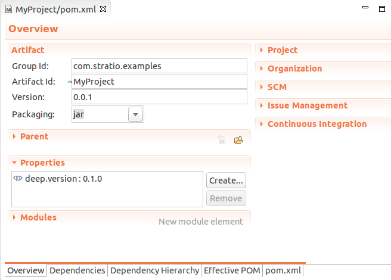

Writing and Running a Basic Application for Stratio Deep
========================================================

In this tutorial you will learn how to write a java, scala or mixed
project for building Stratio Deep applications and how to run it on a
local instance or a standalone cluster. Instructions are based on the
Eclipse environment but any equivalent can be used.

Table of Contents
=================

-  `Before you start <#before-you-start>`__

   -  `Prerequisites <#prerequisites>`__
   -  `Resources <#resources>`__

-  `Creating the project <#creating-the-project>`__

   -  `Step 1: Create an empty
      project <#step-1-create-an-empty-project>`__
   -  `Step 2: Import the project
      skeleton <#step-2-import-the-project-skeleton>`__
   -  `Step 3: Update dependency
      versions <#step-3-update-dependency-versions>`__

-  `Running the application <#running-the-application>`__

   -  `Step 1: Configure the context <#step-1-configure-the-context>`__
   -  `Step 2: Build the application <#step-2-build-the-application>`__
   -  `Step 3: Run it <#step-3-run-it>`__

-  `Where to go from here <#where-to-go-from-here>`__

Before you start
================

Prerequisites
-------------

-  A `Stratio Installation </getting-started.html>`__
-  `Eclipse <https://www.eclipse.org/>`__ or an equivalent IDE.
-  `Oracle JDK
   7 <http://www.oracle.com/technetwork/java/javase/downloads/index.html>`__.
-  `Apache Maven <http://maven.apache.org/>`__: Stratio Deep is
   available in a Maven repository that will be used in this tutorial.
-  `Scala <http://www.scala-lang.org/>`__ >=2.10.3.
-  Scala-IDE: follow `instructions at Eclipse
   marketplace <http://marketplace.eclipse.org/marketplace-client-intro>`__
   to install it from the marketplace (recommended over downloading the
   plugin from scala-ide.org).
-  m2eclipse-scala plugin: follow `instructions at
   scala-ide.org <http://scala-ide.org/docs/tutorials/m2eclipse/index.html>`__
   for installation.

Resources
---------

Here is a list of the resources that will be used in this tutorial. You
can download them now or as you go through the instructions. Links will
be provided later as they will be needed.

-  `Java project example <resources/JavaProject.zip>`__
-  `Scala project example <resources/ScalaProject.zip>`__
-  `Mixed java + scala project example <resources/MixedProject.zip>`__

Creating the project
====================

Step 1: Create an empty project
-------------------------------

-  Launch Eclipse and in the menu choose File -> New -> Project
-  In the “New project” window select “Project” under “General” and
   click “Next”:

.. figure:: images/t40-01-newProject.png
   :alt: Screenshot of the New Project window in Eclipse

   Screenshot of the New Project window in Eclipse
In the next window, enter a name for your project and click “Finish”:

.. figure:: images/t40-02-projectName.png
   :alt: Screenshot of the Project Name window in Eclipse

   Screenshot of the Project Name window in Eclipse
The newly created project now appears in the package explorer.

Step 2: Import the project skeleton
-----------------------------------

Download the project skeleton of your choice and save it in a convenient
location:

-  `Java project <resources/JavaProject.zip>`__
-  `Scala project <resources/ScalaProject.zip>`__
-  `Mixed java + scala project <resources/MixedProject.zip>`__

In the menu, choose File -> Import. In the “Import” window, select
“Archive file” in the section “General”, and click “Next”:

.. figure:: images/t40-03-importWindow.png
   :alt: Screenshot of the Import window in Eclipse

   Screenshot of the Import window in Eclipse
In the next screen:

-  Navigate to the zip file you just downloaded using the “Browse…”
   button.
-  Fill in “Into folder” with the name of the project (or use the
   “Browse…” button to select it from a list).
-  Check “Overwrite existing resources without warning”,
-  and click “Finish”

.. figure:: images/t40-04-importFromFile1.png
   :alt: Screenshot of the Importing from Archive file window in Eclipse

   Screenshot of the Importing from Archive file window in Eclipse
The structure of the project will be displayed in the package explorer.
Give it a time for Maven to check and download dependencies. Finally the
project should appear free of errors.

Step 3: Update dependency versions
----------------------------------

The last step is to check that the project is using the same Stratio
Deep version than your installation. In order to do so, open the pom.xml
file and check the deep.version property in the overview:

   Screenshot of the Overview of the pom file in Eclipse
To modify the version, double-click on it.

The java project contains an example class (JavaExample.java) and an
example test (TestJava.java), the scala one an example object
(ScalaExample.app) and an example test (TestScala.scala), the mixed
project contains all the formers.

Navigate through your project to get familiar with it. You can add your
own code and optionally create an entity object to work with Cassandra
tables (see `Creating an Entity Object for Cassandra in Stratio
Deep <t30-entity-object-cassandra.html>`__ for instructions).

Running the application
=======================

To run the examples provided in the project, you will need some testing
data in Cassandra. If you don’t have any yet, create a keyspace and
table for that purpose:

-  Launch the Cassandra shell in the Sandbox:

.. code:: shell-session

    $ cqlsh
    Connected to Test Cluster at localhost:9160.
    [cqlsh 4.1.1 | Cassandra 2.0.53 | CQL spec 3.1.1 | Thrift protocol 19.39.0]
    Use HELP for help.
    cqlsh>

-  Then create a keyspace, a table and fill it with at least one row:

.. code:: shell-session

    cqlsh> CREATE KEYSPACE test WITH replication = {
          'class': 'SimpleStrategy',
          'replication_factor': '1'
    };
    cqlsh> use test;
    cqlsh:test> CREATE TABLE mytable (
       thekey      text PRIMARY KEY,
       description text);
    cqlsh:test> INSERT INTO mytable (thekey, description) values ('001', 'My first table');
    cqlsh:test> exit

Step 1: Configure the context
-----------------------------

To run the examples provided in the project skeleton, context properties
have to be edited according to your cluster installation. If you are
using the Sandbox, you can skip this section since the properties are
already set to work with the Stratio VM (`skip to Step
2 <#runningStep2>`__).

-  Edit JavaExample.java (for Java and mixed projects) and/or
   ScalaExample.scala (for Scala and mixed project) an look for the
   comment “context properties”.
-  Edit the value of the cluster, jar, cassandraHost and cassandraPort
   for your context.

Alt 1: Local instance
~~~~~~~~~~~~~~~~~~~~~

.. code:: java

    // context properties
    String cluster = "local";
    String jobName = "stratioDeepExample";
    String deepPath = "/PATH/TO/STRATIODEEP";
    String jar = "file:/PATH/TO/JAR/MyProject-0.0.1.jar";
    String cassandraHost = "localhost";
    int cassandraPort = 9160;
    String keyspaceName = "test";
    String tableName = "mytable";

Alt 2: Standalone cluster
~~~~~~~~~~~~~~~~~~~~~~~~~

Point your browser to the web UI of your cluster and copy the address of
your master. It should look like spark://YOURHOSTNAME:7077.

.. code:: java

    // context properties
    String cluster = "spark://YOURHOSTNAME:7077";
    String jobName = "stratioDeepExample";
    String deepPath = "/PATH/TO/STRATIODEEP";
    String jar = "file:/PATH/TO/JAR/MyProject-0.0.1.jar";
    String cassandraHost = "localhost";
    int cassandraPort = 9160;
    String keyspaceName = "test";
    String tableName = "mytable";

Step 2: Build the application
-----------------------------

The sources have been compiled at import time as long as the option
“Build automatically” was set. If it is not the case, then compile them
manually:

-  In the menu choose Project -> Build Project

Once compiled, the jar can be packaged:

-  In the Package Explorer, select your project
-  In the menu, choose Run -> Run as -> Maven build
-  In the “Edit configuration” dialog, enter “package” under Goals and
   click “Run”:

.. figure:: images/t40-06-runAsMaven11.png
   :alt: Screenshot of the Edit Configuration dialog in Eclipse

   Screenshot of the Edit Configuration dialog in Eclipse
For a Java or Scala project, the result should be similar to the
following:

.. code:: shell-session

    Results :

    Tests run: 1, Failures: 0, Errors: 0, Skipped: 0

    [INFO] Building jar: /PATH_TO_WORKSPACE/MyProject/target/MyProject-0.0.1.jar
    [INFO] ------------------------------------------------------------------------
    [INFO] BUILD SUCCESS
    [INFO] ------------------------------------------------------------------------

And as follow for a mixed one:

.. code:: shell-session

    Results :

    Tests run: 2, Failures: 0, Errors: 0, Skipped: 0

    [INFO] Building jar: /PATH_TO_WORKSPACE/MyProject/target/MyProject-0.0.1.jar
    [INFO] ------------------------------------------------------------------------
    [INFO] BUILD SUCCESS
    [INFO] ------------------------------------------------------------------------

Finally, copy the jar to the same location that has been set in "`Step
1: Configure the Context <#step-1-configure-the-context>`__\ " (variable
"jar"):

.. code:: shell-session

    $ cp /PATH/TO/ECLIPSE_WORKSPACE/MyProject/target/MyProject-0.0.1.jar /PATH/TO/JAR

Step 3: Run it
--------------

In a terminal, enter at the prompt:

.. code:: shell-session

    # For a Java or mixed project:
    $ bin/spark-submit --master CLUSTER_ADDRESS --class com.stratio.examples.JavaExample --jars /PATH/TO/JAR/MyProject-0.0.1.jar /PATH/TO/JAR/MyProject-0.0.1.jar

    # For a Scala or mixed project:
    $ bin/spark-submit --master CLUSTER_ADDRESS --class com.stratio.examples.ScalaExample --jars /PATH/TO/JAR/MyProject-0.0.1.jar /PATH/TO/JAR/MyProject-0.0.1.jar

where CLUSTER\_ADDRESS should be replaced with “local” or
“spark://YOURHOSTNAME:7077″ and /PATH/TO/JAR with the path of your jar
file.

In both case the last lines of the output should be similar to:

.. code:: shell-session

    14/03/2014 17:32:49 INFO SparkContext: Successfully stopped SparkContext
    Rows in the RDD (JavaClass): 1

Congratulations! You successfully completed this tutorial.

Where to go from here
=====================

If you are planning to write your own Stratio Deep application, `these
examples <using-deep-cassandra-examples.html>`__ may be useful. Those
are snippets written in both Java and Scala.
